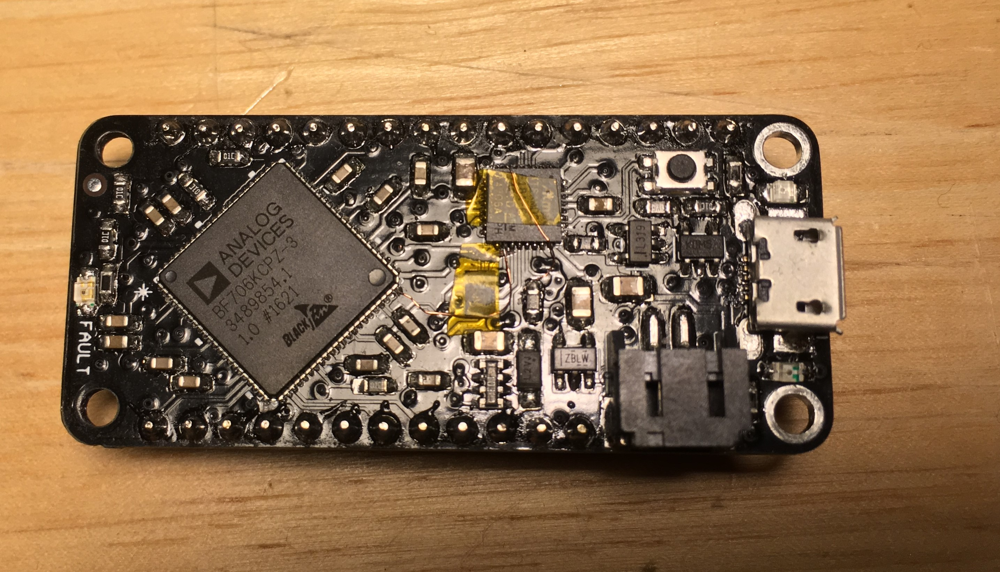

# ArduinoCore-blackfin

This is an Arduino core for BF70x Blackfin+ DSP chips.

## Dependencies
This code depends on:
* [GNU toolchain for blackfin+](https://github.com/deanm1278/blackfin-plus-gnu)
* [BF706 header files](https://github.com/deanm1278/bfin-CMSIS)
